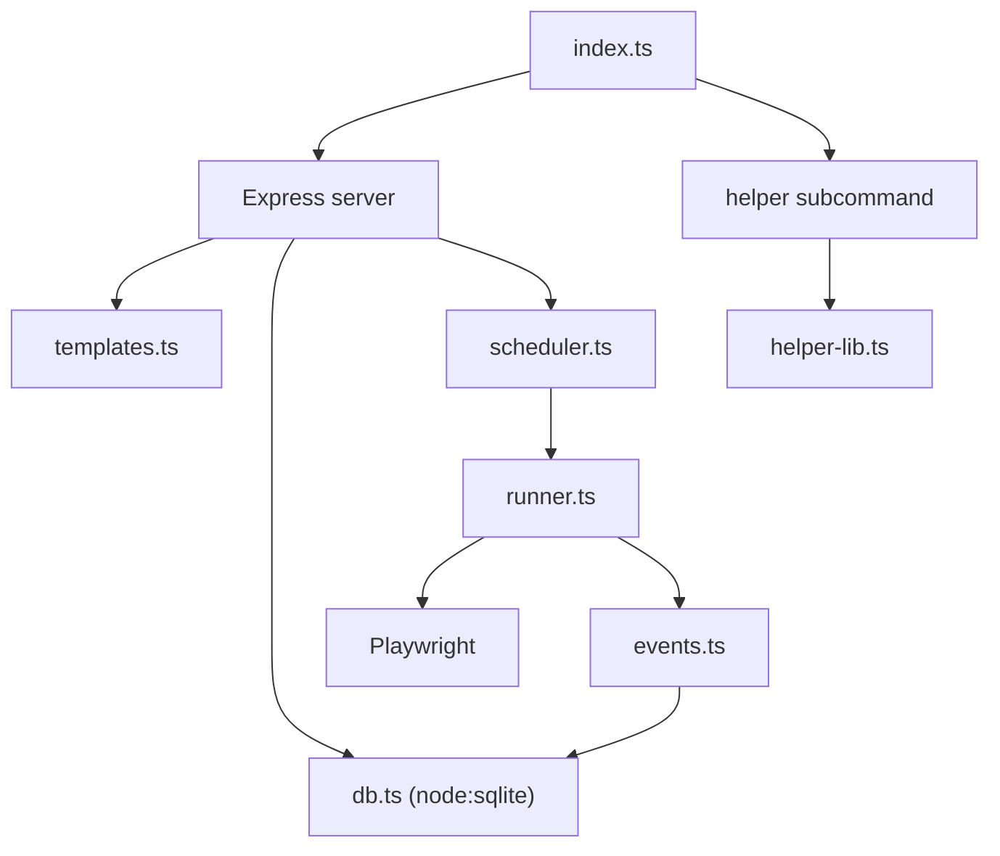

# garden

To install dependencies:

```bash
npm install
```

Requires Node 24 (use `fnm` with `.node-version`).

To run:

```bash
node --experimental-transform-types index.ts
```

Helper CLI (subcommand):

```bash
node --experimental-transform-types index.ts helper record [url] --upload-to http://localhost:3000 --site-id <id>
```

Codebase map:


